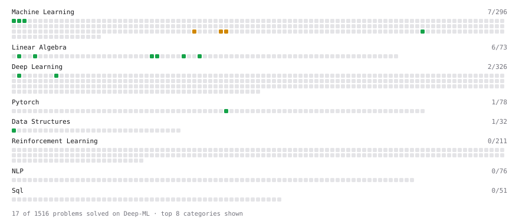

# Deep-ML

My machine learning practice from [Deep-ML](https://www.deep-ml.com). Every solution here was written by hand.

**42** solved · 29 problems · 0 labs · 13 math

[**Browse the interactive portfolio**](https://parth-17512.github.io/deep-ml/) to replay this filling in over time.

## Problems

| | Difficulty | Solved | |
| --- | --- | --- | --- |
| [Calculate Cosine Similarity Between Vectors](https://www.deep-ml.com/problems/76) | easy | 2026-10-01 | [solution](problems/0076-calculate-cosine-similarity-between-vectors) |
| [Calculate Mean by Row or Column](https://www.deep-ml.com/problems/4) | easy | 2026-10-06 | [solution](problems/0004-calculate-mean-by-row-or-column) |
| [Check Linear Independence of Vectors](https://www.deep-ml.com/problems/331) | easy | 2026-10-10 | [solution](problems/0331-check-linear-independence-of-vectors) |
| [Derivative of a Polynomial](https://www.deep-ml.com/problems/116) | easy | 2026-10-03 | [solution](problems/0116-derivative-of-a-polynomial) |
| [Descriptive Statistics Calculator](https://www.deep-ml.com/problems/78) | easy | 2026-10-05 | [solution](problems/0078-descriptive-statistics-calculator) |
| [Dot Product Calculator](https://www.deep-ml.com/problems/83) | easy | 2026-09-29 | [solution](problems/0083-dot-product-calculator) |
| [Empirical Probability Mass Function (PMF)](https://www.deep-ml.com/problems/184) | easy | 2026-10-06 | [solution](problems/0184-empirical-probability-mass-function-pmf) |
| [Expected Value and Variance of an n-Sided Die](https://www.deep-ml.com/problems/179) | easy | 2026-10-06 | [solution](problems/0179-expected-value-and-variance-of-an-n-sided-die) |
| [Feature Scaling Implementation](https://www.deep-ml.com/problems/16) | easy | 2026-09-24 | [solution](problems/0016-feature-scaling-implementation) |
| [Gradient Direction and Magnitude](https://www.deep-ml.com/problems/308) | easy | 2026-10-04 | [solution](problems/0308-gradient-direction-and-magnitude) |
| [Implement ReLU Activation Function](https://www.deep-ml.com/problems/42) | easy | 2026-09-26 | [solution](problems/0042-implement-relu-activation-function) |
| [Linear Regression Using Gradient Descent](https://www.deep-ml.com/problems/15) | easy | 2026-09-27 | [solution](problems/0015-linear-regression-using-gradient-descent) |
| [Linear Regression Using Normal Equation](https://www.deep-ml.com/problems/14) | easy | 2026-09-26 | [solution](problems/0014-linear-regression-using-normal-equation) |
| [Matrix Determinant & Trace](https://www.deep-ml.com/problems/195) | easy | 2026-10-08 | [solution](problems/0195-matrix-determinant-trace) |
| [Matrix-Vector Dot Product](https://www.deep-ml.com/problems/1) | easy | 2026-10-02 | [solution](problems/0001-matrix-vector-dot-product) |
| [Mean Squared Error from Scratch](https://www.deep-ml.com/problems/1228) | easy | 2026-09-26 | [solution](problems/1228-mean-squared-error-from-scratch) |
| [Min-Max Scaling of Feature Values](https://www.deep-ml.com/problems/112) | easy | 2026-09-24 | [solution](problems/0112-min-max-scaling-of-feature-values) |
| [Random Train/Validation/Test Split with Shuffling](https://www.deep-ml.com/problems/1058) | easy | 2026-09-24 | [solution](problems/1058-random-train-validation-test-split-with-shuffling) |
| [Scalar Multiplication of a Matrix](https://www.deep-ml.com/problems/5) | easy | 2026-10-02 | [solution](problems/0005-scalar-multiplication-of-a-matrix) |
| [Softmax Activation Function Implementation ](https://www.deep-ml.com/problems/23) | easy | 2026-09-26 | [solution](problems/0023-softmax-activation-function-implementation) |
| [Transpose of a Matrix](https://www.deep-ml.com/problems/2) | easy | 2026-10-02 | [solution](problems/0002-transpose-of-a-matrix) |
| [Vector Element-wise Sum](https://www.deep-ml.com/problems/121) | easy | 2026-10-01 | [solution](problems/0121-vector-element-wise-sum) |
| [Vector Norms (L1/L2/L-inf) and the Frobenius Norm](https://www.deep-ml.com/problems/328) | easy | 2026-09-28 | [solution](problems/0328-vector-norms-l1-l2-l-inf-and-the-frobenius-norm) |
| [Dummy Classifier Baseline](https://www.deep-ml.com/problems/847) | medium | 2026-09-26 | [solution](problems/0847-dummy-classifier-baseline) |
| [Dummy Regressor Baseline](https://www.deep-ml.com/problems/848) | medium | 2026-09-26 | [solution](problems/0848-dummy-regressor-baseline) |
| [Matrix Rank](https://www.deep-ml.com/problems/329) | medium | 2026-10-09 | [solution](problems/0329-matrix-rank) |
| [Matrix times Matrix ](https://www.deep-ml.com/problems/9) | medium | 2026-10-03 | [solution](problems/0009-matrix-times-matrix) |
| [Quotient Rule for Derivatives](https://www.deep-ml.com/problems/312) | medium | 2026-10-03 | [solution](problems/0312-quotient-rule-for-derivatives) |
| [StandardScaler Fit and Transform](https://www.deep-ml.com/problems/842) | medium | 2026-09-24 | [solution](problems/0842-standardscaler-fit-and-transform) |

## Math

| | Difficulty | Solved | |
| --- | --- | --- | --- |
| [Derivatives and Gradients](https://www.deep-ml.com/math-problems/1) | easy | 2026-10-03 | [solution](math/0001-derivatives-and-gradients) |
| [Gradient Descent Updates](https://www.deep-ml.com/math-problems/5) | easy | 2026-10-03 | [solution](math/0005-gradient-descent-updates) |
| [Matrix Basics](https://www.deep-ml.com/math-problems/9) | easy | 2026-10-01 | [solution](math/0009-matrix-basics) |
| [Probability Fundamentals](https://www.deep-ml.com/math-problems/19) | easy | 2026-10-05 | [solution](math/0019-probability-fundamentals) |
| [Vector Operations](https://www.deep-ml.com/math-problems/7) | easy | 2026-09-30 | [solution](math/0007-vector-operations) |
| [Covariance and Correlation](https://www.deep-ml.com/math-problems/17) | medium | 2026-10-08 | [solution](math/0017-covariance-and-correlation) |
| [Determinants and Trace](https://www.deep-ml.com/math-problems/11) | medium | 2026-10-07 | [solution](math/0011-determinants-and-trace) |
| [Inverse and Rank](https://www.deep-ml.com/math-problems/12) | medium | 2026-10-07 | [solution](math/0012-inverse-and-rank) |
| [Least Squares and the Normal Equations](https://www.deep-ml.com/math-problems/34) | medium | 2026-10-08 | [solution](math/0034-least-squares-and-the-normal-equations) |
| [Matrix Multiplication](https://www.deep-ml.com/math-problems/10) | medium | 2026-10-01 | [solution](math/0010-matrix-multiplication) |
| [Orthogonality and Projections](https://www.deep-ml.com/math-problems/14) | medium | 2026-10-07 | [solution](math/0014-orthogonality-and-projections) |
| [Solving Linear Systems](https://www.deep-ml.com/math-problems/13) | medium | 2026-10-07 | [solution](math/0013-solving-linear-systems) |
| [Vector Norms and Linear Independence](https://www.deep-ml.com/math-problems/8) | medium | 2026-10-01 | [solution](math/0008-vector-norms-and-linear-independence) |

---

_This file is regenerated by Deep-ML on every push._
